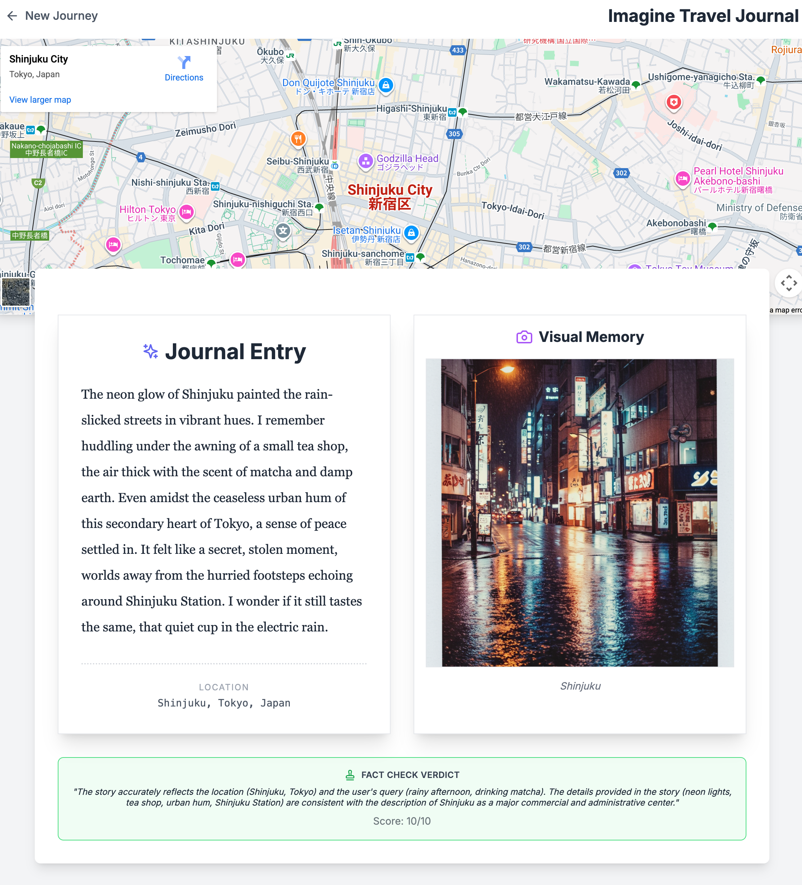

# Imagine Travel

## Overview

**Imagine Travel** is an AI-powered agentic application that transforms your raw travel memories (e.g., "I went to Tokyo and had sushi") into rich, vivid journal entries. It combines real-world grounding, historical context, and creative generation to build a cohesive story, complete with a visual memory and a fact-checked verdict.

This project demonstrates a sophisticated **Sequential Workflow** with an embedded **Feedback Loop**, built using a custom **Agent Development Kit (ADK)**. It orchestrates multiple external tools to verify, enrich, and visualize your experience. A key improvement is **progressive rendering**, where the map, story, and other elements appear as soon as their data is available from the backend, providing a more responsive user experience.

## Goals

1.  **Grounding**: Anchor user memories to real-world locations using Google Maps, ensuring accurate name and address extraction.
2.  **Enrichment**: Augment stories with historical facts using Wikipedia.
3.  **Creative Drafting**: Generate high-quality, evocative journal entries using an LLM, with iterative refinement.
4.  **Visualization**: Create a consistent visual memory (image) representing the story.
5.  **Quality Assurance**: Use an LLM Judge to fact-check the generated content against the original data, iterating on the draft if inaccuracies are found.

## Tools and APIs Used

This application integrates **3 distinct external APIs**:

1.  **Google Maps Platform**:
    *   **Places API (New)**: Used by the agent to find the exact location, address, and details of the user's memory (via `GoogleMapsMCP`). The agent is now specifically instructed to extract consistent place names and complete addresses for robust mapping.
    *   **Maps Embed API**: Used by the frontend to display an interactive map of the location.
2.  **Wikipedia API**: Used to fetch historical context and summaries about the location.
3.  **Google Gemini API**:
    *   **Gemini 2.0 Flash**: Powers the LLM for drafting the journal, judging the content, and extracting location keywords.
    *   **Imagen 4.0**: Generates the "polaroid style" visual representation of the memory.

## Project Structure

-   `backend/`: Python FastAPI backend.
    -   `agents/`: Contains the specific agent logic (`travel_imagination.py`) and tool integrations (`tools.py`).
    -   `server.py`: The FastAPI server handling WebSocket connections and agent execution.
-   `frontend/`: React/Vite frontend.
    -   `src/App.jsx`: Main UI logic, handling the WebSocket stream, progressive rendering, and layout.
    -   `src/components/`: Reusable UI components like `LogPane`.

## How to Build and Run

### Prerequisites

-   **Python 3.9+** (with `uv` recommended for package management and virtual environments)
-   **Node.js** (LTS recommended) and `npm`
-   **API Keys**:
    -   **Google Maps API Key**: Must have **Places API (New)** and **Maps Embed API** enabled.
    -   **Google Gemini API Key**: For accessing Gemini 2.0 and Imagen models.

### 1. Setup Environment Variables

Create a `.env` file in the `backend/` directory (you can copy `.env.template` if it exists, or create new). Ensure `load_dotenv()` is called early in `backend/server.py` to load these.

```bash
# Example content for backend/.env
GOOGLE_MAPS_API_KEY=your_google_maps_key
VITE_GOOGLE_MAPS_API_KEY=your_frontend_maps_key
GOOGLE_API_KEY=your_gemini_api_key
# VITE_API_BASE_URL is set by Cloud Run or defaults to localhost for dev
```

### 2. Backend Setup

1.  **Create and Activate a Virtual Environment** (recommended):

    ```bash
    # From the project root
    python -m venv .venv
    source .venv/bin/activate
    ```

2.  **Install Dependencies** (using `uv`):

    First, ensure `uv` is installed (e.g., `pip install uv`). Then:

    ```bash
    # From the project root
    uv pip install -r backend/requirements.txt
    ```

3.  **Start the Backend Server**:
    We provide a helper script in the root that sets up the path correctly:

    *(Note: The Dockerfile now uses a direct uvicorn command for deployment, but this is still valid for local development.)*

    ```bash
    # From the project root
    ./run_backend.sh
    ```

    The backend will run on `http://0.0.0.0:8000`.

### 3. Frontend Setup

In a new terminal, navigate to the `frontend/` directory:

```bash
cd frontend
```

Install dependencies:

```bash
npm install
```

Start the development server (logs will be redirected to `frontend.log` in the project root):

```bash
npm run dev
```

The frontend will typically run on `http://localhost:3000` (or 3001/5173 if 3000 is taken). Check the `frontend.log` file for output.

### 4. Usage

1.  Open your browser to the frontend URL (e.g., `http://localhost:3000`).
2.  Enter a travel memory (e.g., "Walking across the Brooklyn Bridge at sunset with a slice of pizza").
3.  Click **Let's Go**.

4.  Watch the **Execution Logs** (bottom panel) as the agent grounds your request, researches, and iteratively drafts your story. The map and story will appear progressively.

5.  View the final result: A journal entry, an interactive map, a generated image, and a fact-check verdict.

### Screenshots

#### Landing Page


#### Results Page


## Deployment (Google Cloud Run)

This application is containerized and ready to be deployed to **Google Cloud Run** as a single service (Frontend + Backend).

### Prerequisites

1.  **Google Cloud Project**: You need an active GCP project.
2.  **gcloud CLI**: Installed and authenticated (`gcloud auth login`, `gcloud config set project YOUR_PROJECT_ID`).
3.  **APIs Enabled**: Cloud Run API, Cloud Build API, Artifact Registry API, **Vertex AI API** (for Imagen models), and the **Google Maps Platform (MCP) services**.
    ```bash
    # Enable the Maps MCP service
    gcloud beta services enable mapstools.googleapis.com --project=$PROJECT_ID
    ```

### Deployment Steps

1.  **Run the deployment script**:

    This script builds the Docker image (multi-stage build for React + Python) and deploys it to Cloud Run. Ensure your `gcloud` project is set correctly (e.g., `gcloud config set project smcghee-ai-playground`).

    ```bash
    ./deploy.sh
    ```

    *If the script fails due to permissions or API limits, you can manually deploy using:*

    *(Note: The Dockerfile's CMD now directly uses uvicorn, ensuring it binds correctly to the Cloud Run PORT.)*
    ```bash
    gcloud run deploy imagine-travel --source . --platform managed --region us-central1 --allow-unauthenticated --update-env-vars="GOOGLE_MAPS_API_KEY=your_key,GOOGLE_API_KEY=your_key"
    ```

2.  **Access the App**:
    The command output will provide a Service URL (e.g., `https://imagine-travel-xyz-uc.a.run.app`). Open this URL in your browser.

## Observability (OpenTelemetry)

This project has been instrumented with **OpenTelemetry** to provide comprehensive tracing and observability for the agent's execution, including LLM calls, tool usage, and network interactions.

### Features
*   **Auto-Instrumentation**: FastAPI, Requests, HTTPX, and Google GenAI libraries are automatically traced.
*   **Manual Instrumentation**: Key custom logic, such as the `generate_images` tool (Vertex AI + GCS) and `research_location` (Wikipedia), has been manually instrumented with custom spans for granular visibility.
*   **Dual Export Modes**:
    *   **Local Development**: Exports traces to a local OpenTelemetry Collector (via OTLP), which can then forward to console or other backends.
    *   **Cloud Run**: Supports direct export to **Google Cloud Trace** without a sidecar collector.

### Configuration

The observability setup is managed in `backend/otel_setup.py`.

**Environment Variables:**
*   `ENABLE_TELEMETRY`: Set to `false` to disable telemetry entirely (default: `true`).
*   `USE_GCP_EXPORTER`: Set to `true` to enable direct export to Google Cloud Trace (recommended for Cloud Run).
*   `OTEL_CONSOLE_EXPORTER`: Set to `true` to print traces to the console (useful for debugging).

### Running Locally with Telemetry

1.  **Start the Collector**:
    Use the provided helper script to run a local OpenTelemetry Collector (requires Docker). This configures the collector to export to Google Cloud (using your local credentials) and the console.
    ```bash
    ./run_local_collector.sh
    ```

2.  **Run the Backend**:
    ```bash
    ./run_backend.sh
    ```

### Documentation References
*   [OpenTelemetry Python Documentation](https://opentelemetry.io/docs/languages/python/)
*   [Google Cloud Trace with OpenTelemetry](https://cloud.google.com/trace/docs/setup/python-ot)
*   [Instrumenting AI Agents (Google Cloud)](https://docs.cloud.google.com/stackdriver/docs/instrumentation/ai-agent-adk)